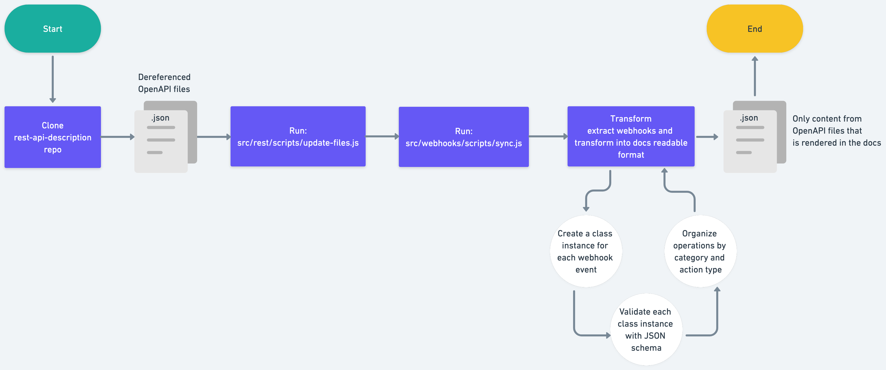

# Webhooks pipeline

Our webhooks pipeline creates autogenerated webhooks documentation for docs.github.com/webhooks-and-events/webhooks/webhook-events-and-payloads from the OpenAPI stored in the open-source repository [`github/rest-api-description`](https://github.com/github/rest-api-description).

The pipeline is used to generate data that is used by the docs.github.com site when deployed locally, in review environments, or in production.

## How does it work

A [workflow](.github/workflows/sync-openapi.yml) is used to trigger the automation of the webhooks documentation. The workflow runs automatically on a schedule. The workflow that triggers the webhooks pipeline also triggers other automation pipelines that use the OpenAPI as the source data:

- GitHub Apps
- REST
- Webhooks

The workflow automatically creates a pull request with the changes (for all three pipelines) and the label `github-openapi-bot`.

The workflow runs the `npm run sync-rest` script, which then calls the `src/webhooks/scripts/sync.ts` script.

  - `src/webhooks/scripts/sync.ts` - The entrypoint script that runs the webhooks pipeline.
- `src/webhooks/tests` - The tests used to verify the webhooks pipeline.
